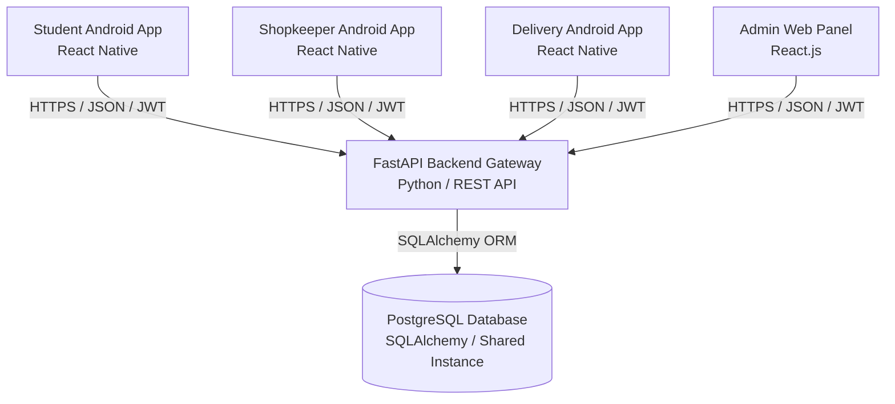

# CampusBite — System Architecture

This document describes the high-level system architecture, directories, security framework, and layout configurations for the **CampusBite** campus food delivery platform.

---

## 1. High-Level Ecosystem Layout

CampusBite is a multi-tenant platform designed to operate across multiple cities, campuses, and sub-location structures. It consists of four distinct client interfaces communicating with a centralized, single-database FastAPI backend.



---

## 2. Directory Structure

The repository is organized to maintain a clear separation of concerns between client platforms, admin panels, and backend systems:

```
CampusBite/
├── mobile/                  # Android Native Applications (React Native)
│   ├── student-app/         # Student interface: browsing, checkout, order tracking
│   ├── shopkeeper-app/      # Shopkeeper interface: menu update, order management
│   └── delivery-app/        # Delivery interface: assignment, maps, delivery verification
│
├── admin/                   # Admin Web Panel (React.js SPA)
│   └── Dashboard interface for managing users, commissions, campus setup, complaints, and analytics
│
├── backend/                 # Python + FastAPI backend application
│   ├── app/
│   │   ├── api/             # REST Routers (v1) grouped by role
│   │   │   ├── auth.py      # Registration & Login endpoints
│   │   │   ├── student.py   # Student flow (browsing, cart, orders)
│   │   │   ├── shop.py      # Shopkeeper flow (menu management, orders)
│   │   │   ├── delivery.py  # Delivery flow (orders, status updates, OTP)
│   │   │   └── admin.py     # System administration & dashboard updates
│   │   ├── core/            # Config variables, DB engines, JWT security tools
│   │   ├── models/          # Declarative SQLAlchemy models (PostgreSQL)
│   │   ├── schemas/         # Pydantic serialization/deserialization schemas
│   │   └── main.py          # FastAPI application initialization & middleware
│   └── requirements.txt     # Python dependency configuration
│
├── docs/                    # Design Specifications
│   ├── ARCHITECTURE.md      # System layout and location design (this document)
│   ├── DATABASE.md          # PostgreSQL database models and indices
│   └── API.md               # API endpoints, request bodies, and responses
│
└── README.md                # Quick-start guide
```

---

## 3. Dynamic Location Architecture

To prevent hard-coding any specific campus (such as BBD campus) or buildings, CampusBite uses a recursive database-driven location tree. All client interfaces build their menus and checkout location dropdowns dynamically from this structure.

### 3.1 Academic/College Location Branch
For users ordering to classrooms, labs, or faculty blocks:
$$\text{City} \longrightarrow \text{Campus} \longrightarrow \text{College} \longrightarrow \text{Block/Building} \longrightarrow \text{Floor} \longrightarrow \text{Room/Class}$$

### 3.2 Residential/Hostel Location Branch
For users ordering directly to their hostel rooms:
$$\text{Campus} \longrightarrow \text{Hostel} \longrightarrow \text{Hostel Block} \longrightarrow \text{Floor} \longrightarrow \text{Room}$$

### 3.3 Dynamic Delivery Addresses
When a student checks out, the backend stores a frozen snapshot of their location coordinates and details (e.g. `{"building": "Block B", "floor": "3rd Floor", "room": "Classroom 302"}`) on the `Order` record to ensure delivery logs remain accurate even if structural labels are updated in the Admin panel.

---

## 4. Authentication & Role-Based Access Control (RBAC)

All endpoints require verification via JSON Web Tokens (JWT) signed by the backend and stored or transmitted securely.

### 4.1 Roles & Allowed Functions

| Role | Interface | System Authorization / Scope |
| :--- | :--- | :--- |
| **Student** | Student App | Browse active shops & items on their assigned `campus_id`. Read own orders, check out, track order, post review, file complaints. |
| **Shopkeeper** | Shopkeeper App | Manage menu items & categories. Read, accept, prepare, or flag orders belonging strictly to their `shop_id`. Track personal earnings. |
| **Delivery Partner** | Delivery App | Update transit availability. Access assigned orders, view customer drop-off coordinates, verify deliveries via OTP, track earnings. |
| **Admin** | Admin Panel | Full write/read permissions across all models: City, Campus, College, Hostels, Users, Commission Rates, Complaints resolution. |

### 4.2 Security Rules

1. **Isolation**: A shopkeeper cannot access API routes containing metadata or orders of another shop. The backend enforces this through path validations (e.g., matching the shopkeeper's user token payload to the requested resource's owner).
2. **Delivery Security**: Delivery partners are only authorized to read delivery instructions (such as customer name, phone number, and building address) for orders currently assigned to them.
3. **Data Verification**: All password storage uses **bcrypt** hashing. Credentials are never stored as plain text. Input payloads are validated by FastAPI using **Pydantic** models, filtering out SQL injection and format mismatches.
