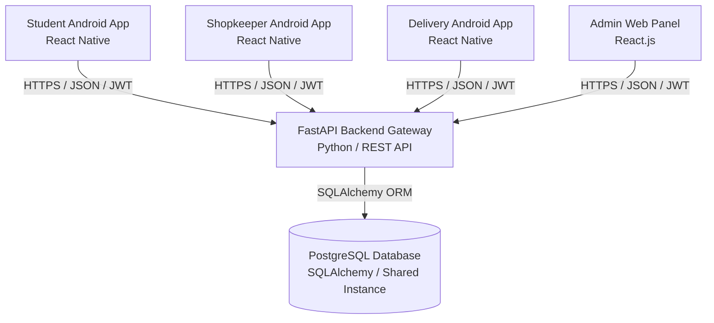

# CampusBite — System Architecture

This document describes the high-level system architecture, client applications, security framework, payment abstraction, and dynamic multi-college infrastructure for **CampusBite**.

---

## 1. High-Level Ecosystem Layout

CampusBite is a multi-tenant platform designed to operate across multiple cities, campuses, colleges, academic blocks, and residential hostels. It consists of four distinct client interfaces communicating with a centralized, single-database FastAPI backend.



---

## 2. Directory Structure

```
CampusBite/
├── mobile/                  # Android Native Applications (React Native)
│   ├── student-app/         # Student interface: browsing, checkout, order tracking
│   ├── shopkeeper-app/      # Shopkeeper interface: menu update, order management
│   └── delivery-app/        # Delivery interface: assignment, maps, delivery verification
│
├── admin/                   # Admin Web Panel (React.js SPA / Vite)
│   └── Dashboard interface for managing users, commissions, campus setup, shops, orders, and audit logs
│
├── backend/                 # Python + FastAPI backend application
│   ├── app/
│   │   ├── api/             # REST Routers (v1) grouped by role
│   │   │   ├── auth.py      # Registration & Login endpoints
│   │   │   ├── locations.py # Dynamic Campuses, Colleges, Blocks, Hostels
│   │   │   ├── student_ops.py # Student ordering, menu, order tracking
│   │   │   ├── shopkeeper_ops.py # Shop management, food menu, order lifecycle
│   │   │   ├── delivery_ops.py # Delivery claims, OTP validation, rider payouts
│   │   │   └── admin_ops.py # Admin metrics, location CRUD, vendor approvals, overrides, audits
│   │   ├── core/            # Config variables, DB engines, JWT security tools
│   │   ├── models/          # Declarative SQLAlchemy models (PostgreSQL)
│   │   ├── schemas/         # Pydantic serialization/deserialization schemas
│   │   ├── services/        # Business logic services (PaymentService, etc.)
│   │   └── main.py          # FastAPI application initialization & middleware
│   ├── tests/               # Pytest integration, E2E, and security test suites
│   ├── alembic/             # Database schema migrations
│   ├── .env.example         # Production environment template
│   └── requirements.txt     # Python dependency configuration
│
├── docs/                    # Design Specifications
│   ├── ARCHITECTURE.md      # System layout and location design (this document)
│   ├── DATABASE.md          # PostgreSQL database models and indices
│   └── API.md               # API endpoints, request bodies, and responses
│
└── README.md                # Quick-start guide
```

---

## 3. Dynamic Location Architecture

To prevent hard-coding any specific campus or college, CampusBite uses a recursive database-driven location tree:

$$\text{City} \longrightarrow \text{Campus} \longrightarrow \text{College} \longrightarrow \text{Block/Building} \longrightarrow \text{Floor} \longrightarrow \text{Room/Class}$$
$$\text{Campus} \longrightarrow \text{Hostel} \longrightarrow \text{Room}$$

---

## 4. Security & Role-Based Access Control (RBAC)

* **Role Isolation**: Strict server-side `RoleChecker` guards prevent cross-role privilege escalation (e.g. Students accessing Admin endpoints returns `403 Forbidden`).
* **Object Ownership Enforcement**: Shopkeepers can only manage their own canteens/menus/orders; delivery partners can only view their own deliveries; students can only view their own order details.
* **OTP Verification Security**:
  * The 4-digit OTP is generated server-side.
  * In API responses, OTP is visible **only** to the student via `StudentOrderResponse`.
  * Delivery partners, shopkeepers, and public APIs receive `OrderResponse` which strips the OTP field.
  * The delivery verification endpoint validates against a SHA-256 hash stored in the `Delivery` table, enforces a 30-minute expiry window, and locks out the rider after 5 failed attempts.

---

## 5. Payment Architecture

* **Server-Side Validation**: Orders are never marked as paid merely because the client says so.
* **PaymentService**: Located at `backend/app/services/payment_service.py`, abstracts payment session initialization, HMAC-SHA256 signature verification (for gateways like Razorpay/Stripe), and state synchronization (`PENDING`, `SUCCESS`, `FAILED`, `REFUNDED`).

---

## 6. Financial Ledger & Platform Commission

* **Order Subtotal & Fees**: Computed server-side during checkout from the database menu item prices. Client prices are ignored.
* **Delivery Completion**: Shopkeeper net earnings (Subtotal - 10% Platform Commission) and Delivery Partner earnings (Delivery Fee) are credited and recorded in the database strictly once upon OTP verification.
