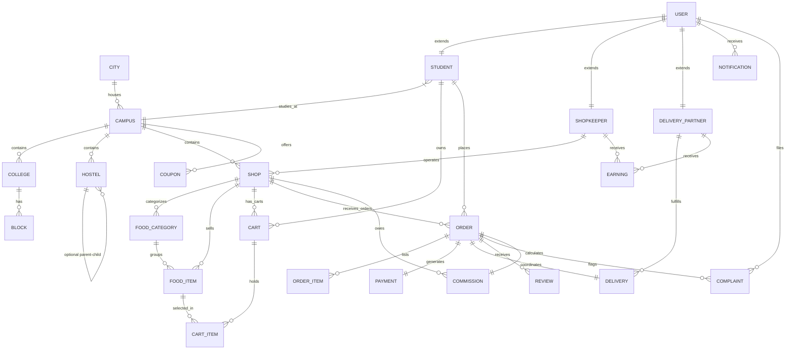

# CampusBite — Database Design

This document details the PostgreSQL relational database schema for the **CampusBite** platform, including entity relationships, index setups, and SQLAlchemy mappings.

---

## 1. Entity Relationship Diagram (ERD)

This diagram outlines the relationships among all 24 database entities.



---

## 2. Table Specifications

### 2.1 Core Location Infrastructure
Designed to support infinite combinations of cities, campuses, colleges, academic blocks, and hostels.

#### `cities`
| Column | Type | Constraints | Description |
| :--- | :--- | :--- | :--- |
| `id` | UUID / Int | Primary Key | Unique City ID |
| `name` | VARCHAR(100) | NOT NULL, UNIQUE | e.g. "Lucknow" |
| `state` | VARCHAR(100) | NOT NULL | e.g. "Uttar Pradesh" |
| `is_active` | BOOLEAN | DEFAULT TRUE | System activity status |
| `created_at` | TIMESTAMP | DEFAULT NOW() | System timestamp |

#### `campuses`
| Column | Type | Constraints | Description |
| :--- | :--- | :--- | :--- |
| `id` | UUID / Int | Primary Key | Unique Campus ID |
| `name` | VARCHAR(150) | NOT NULL | e.g. "BBD University Campus" |
| `address` | TEXT | NOT NULL | Physical address details |
| `latitude` | DECIMAL(10, 8) | Nullable | Geolocation mapping |
| `longitude` | DECIMAL(11, 8) | Nullable | Geolocation mapping |
| `city_id` | Foreign Key | REFERENCES `cities(id)` | Associated City |
| `is_active` | BOOLEAN | DEFAULT TRUE | Active campus flag |

#### `colleges`
| Column | Type | Constraints | Description |
| :--- | :--- | :--- | :--- |
| `id` | UUID / Int | Primary Key | Unique College ID |
| `name` | VARCHAR(150) | NOT NULL | e.g. "BBDNIIT", "BBDCOE" |
| `campus_id` | Foreign Key | REFERENCES `campuses(id)` | Parent campus |

#### `blocks`
| Column | Type | Constraints | Description |
| :--- | :--- | :--- | :--- |
| `id` | UUID / Int | Primary Key | Unique Building ID |
| `name` | VARCHAR(100) | NOT NULL | e.g. "Block A", "Civil Block" |
| `college_id` | Foreign Key | REFERENCES `colleges(id)` (Null) | Optional links to college |
| `campus_id` | Foreign Key | REFERENCES `campuses(id)` | Associated Campus |

#### `hostels`
| Column | Type | Constraints | Description |
| :--- | :--- | :--- | :--- |
| `id` | UUID / Int | Primary Key | Unique Hostel ID |
| `name` | VARCHAR(100) | NOT NULL | e.g. "Boys Hostel 1" |
| `campus_id` | Foreign Key | REFERENCES `campuses(id)` | Associated Campus |

---

### 2.2 Users & Authentication

#### `users`
| Column | Type | Constraints | Description |
| :--- | :--- | :--- | :--- |
| `id` | UUID | Primary Key | Unique login key |
| `email` | VARCHAR(150) | NOT NULL, UNIQUE | User email address |
| `password_hash`| VARCHAR(255) | NOT NULL | Hashed password (Bcrypt) |
| `phone` | VARCHAR(15) | NOT NULL, UNIQUE | User contact number |
| `first_name` | VARCHAR(50) | NOT NULL | User first name |
| `last_name` | VARCHAR(50) | NOT NULL | User last name |
| `role` | VARCHAR(20) | NOT NULL | `STUDENT`, `SHOPKEEPER`, `DELIVERY`, `ADMIN` |
| `status` | VARCHAR(20) | DEFAULT 'ACTIVE' | `ACTIVE`, `INACTIVE`, `SUSPENDED` |
| `created_at` | TIMESTAMP | DEFAULT NOW() | Record creation date |

#### `students`
| Column | Type | Constraints | Description |
| :--- | :--- | :--- | :--- |
| `user_id` | UUID | Primary Key, REFERENCES `users(id)` | Associated User |
| `campus_id` | Foreign Key | REFERENCES `campuses(id)` | Current Campus |
| `college_id` | Foreign Key | REFERENCES `colleges(id)` (Null) | Assigned College (Academic) |
| `block_id` | Foreign Key | REFERENCES `blocks(id)` (Null) | Assigned Block (Academic) |
| `hostel_id` | Foreign Key | REFERENCES `hostels(id)` (Null) | Assigned Hostel (Residential) |
| `room_number` | VARCHAR(20) | Nullable | Room/Classroom number |
| `floor_level` | VARCHAR(20) | Nullable | Floor indicator |
| `is_hosteler` | BOOLEAN | DEFAULT FALSE | Hostel vs. Day-Scholar |

#### `shopkeepers`
| Column | Type | Constraints | Description |
| :--- | :--- | :--- | :--- |
| `user_id` | UUID | Primary Key, REFERENCES `users(id)` | Associated User |
| `bank_details` | JSONB | Nullable | Payout parameters |
| `is_verified` | BOOLEAN | DEFAULT FALSE | KYC/Admin verification status |

#### `delivery_partners`
| Column | Type | Constraints | Description |
| :--- | :--- | :--- | :--- |
| `user_id` | UUID | Primary Key, REFERENCES `users(id)` | Associated User |
| `vehicle_type` | VARCHAR(50) | NOT NULL | e.g. "Bicycle", "Motorcycle" |
| `vehicle_number`| VARCHAR(30) | Nullable | License plate |
| `rating` | DECIMAL(3, 2) | DEFAULT 5.0 | Average rating |
| `is_active` | BOOLEAN | DEFAULT FALSE | Available for order delivery |
| `current_lat` | DECIMAL(10, 8) | Nullable | Real-time coordinates |
| `current_lng` | DECIMAL(11, 8) | Nullable | Real-time coordinates |
| `is_verified` | BOOLEAN | DEFAULT FALSE | KYC/Admin verification status |

---

### 2.3 Shops & Catalogues

#### `shops`
| Column | Type | Constraints | Description |
| :--- | :--- | :--- | :--- |
| `id` | UUID | Primary Key | Unique Shop ID |
| `name` | VARCHAR(150) | NOT NULL | e.g. "Canteen Block A" |
| `description` | TEXT | Nullable | Details about offerings |
| `logo_url` | VARCHAR(255) | Nullable | Media link |
| `shopkeeper_id`| Foreign Key | REFERENCES `shopkeepers(user_id)` | Owner reference |
| `campus_id` | Foreign Key | REFERENCES `campuses(id)` | Located Campus |
| `is_open` | BOOLEAN | DEFAULT TRUE | Operating status |
| `rating` | DECIMAL(3, 2) | DEFAULT 5.0 | Average shop rating |

#### `food_categories`
| Column | Type | Constraints | Description |
| :--- | :--- | :--- | :--- |
| `id` | UUID / Int | Primary Key | Unique Category ID |
| `name` | VARCHAR(100) | NOT NULL | e.g. "Burgers", "Beverages" |
| `shop_id` | Foreign Key | REFERENCES `shops(id)` | Parent Shop |

#### `food_items`
| Column | Type | Constraints | Description |
| :--- | :--- | :--- | :--- |
| `id` | UUID | Primary Key | Unique Item ID |
| `name` | VARCHAR(150) | NOT NULL | e.g. "Cheese Burger" |
| `price` | DECIMAL(10, 2) | NOT NULL | Sale price |
| `image_url` | VARCHAR(255) | Nullable | Food image |
| `is_veg` | BOOLEAN | DEFAULT TRUE | Dietary indicator |
| `is_available` | BOOLEAN | DEFAULT TRUE | Stock availability |
| `category_id` | Foreign Key | REFERENCES `food_categories(id)` | Parent Category |
| `shop_id` | Foreign Key | REFERENCES `shops(id)` | Parent Shop |

---

### 2.4 Carts & Orders Workflow

#### `carts`
| Column | Type | Constraints | Description |
| :--- | :--- | :--- | :--- |
| `id` | UUID | Primary Key | Unique Cart ID |
| `student_id` | Foreign Key | REFERENCES `students(user_id)` | Student owner |
| `shop_id` | Foreign Key | REFERENCES `shops(id)` | Shop context (single shop limit) |

#### `cart_items`
| Column | Type | Constraints | Description |
| :--- | :--- | :--- | :--- |
| `id` | UUID | Primary Key | Unique Cart Item ID |
| `cart_id` | Foreign Key | REFERENCES `carts(id)` ON DELETE CASCADE | Cart container |
| `food_item_id` | Foreign Key | REFERENCES `food_items(id)` | Selected item |
| `quantity` | INT | NOT NULL CHECK (quantity > 0) | Quantity |
| `notes` | VARCHAR(255) | Nullable | Special preparation instructions |

#### `orders`
| Column | Type | Constraints | Description |
| :--- | :--- | :--- | :--- |
| `id` | UUID | Primary Key | Unique Order ID |
| `order_number` | VARCHAR(50) | NOT NULL, UNIQUE | Human-readable ID, e.g. "CB-12345" |
| `student_id` | Foreign Key | REFERENCES `students(user_id)` | Placing customer |
| `shop_id` | Foreign Key | REFERENCES `shops(id)` | Target vendor |
| `status` | VARCHAR(30) | DEFAULT 'PLACED' | `PLACED`, `ACCEPTED`, `PREPARING`, `READY`, `TRANSIT`, `DELIVERED`, `CANCELLED` |
| `subtotal` | DECIMAL(10, 2) | NOT NULL | Items price summary |
| `delivery_fee` | DECIMAL(10, 2) | DEFAULT 0.0 | Delivery cost |
| `discount` | DECIMAL(10, 2) | DEFAULT 0.0 | Coupon reduction |
| `tax` | DECIMAL(10, 2) | DEFAULT 0.0 | Applicable tax |
| `total_amount` | DECIMAL(10, 2) | NOT NULL | Total cost to customer |
| `payment_status`| VARCHAR(20) | DEFAULT 'PENDING' | `PENDING`, `PAID`, `FAILED`, `REFUNDED` |
| `payment_method`| VARCHAR(20) | NOT NULL | `COD`, `ONLINE` |
| `coupon_id` | Foreign Key | REFERENCES `coupons(id)` (Null) | Applied discount coupon |
| `delivery_partner_id`| Foreign Key| REFERENCES `delivery_partners(user_id)` (Null)| Assigned carrier |
| `delivery_address`| JSONB | NOT NULL | Address snapshot details |
| `otp` | VARCHAR(6) | NOT NULL | Verification Code for Delivery |
| `created_at` | TIMESTAMP | DEFAULT NOW() | Order timestamp |

#### `order_items`
| Column | Type | Constraints | Description |
| :--- | :--- | :--- | :--- |
| `id` | UUID | Primary Key | Unique Order Item ID |
| `order_id` | Foreign Key | REFERENCES `orders(id)` ON DELETE CASCADE | Parent Order |
| `food_item_id` | Foreign Key | REFERENCES `food_items(id)` | Reference item |
| `name` | VARCHAR(150) | NOT NULL | Frozen Item Name |
| `price` | DECIMAL(10, 2) | NOT NULL | Frozen Item Price |
| `quantity` | INT | NOT NULL | Ordered Quantity |
| `notes` | VARCHAR(255) | Nullable | Preparation notes |

---

### 2.5 Payments, Commission & Earnings

#### `payments`
| Column | Type | Constraints | Description |
| :--- | :--- | :--- | :--- |
| `id` | UUID | Primary Key | Unique Payment ID |
| `order_id` | Foreign Key | REFERENCES `orders(id)` | Parent Order |
| `amount` | DECIMAL(10, 2) | NOT NULL | Transaction amount |
| `status` | VARCHAR(20) | DEFAULT 'PENDING' | `PENDING`, `SUCCESS`, `FAILED` |
| `transaction_ref`| VARCHAR(150)| Nullable | Gateway ID (Stripe/Razorpay) |
| `gateway` | VARCHAR(50) | NOT NULL | e.g. "RAZORPAY", "STRIPE" |
| `created_at` | TIMESTAMP | DEFAULT NOW() | Payment timestamp |

#### `commissions`
| Column | Type | Constraints | Description |
| :--- | :--- | :--- | :--- |
| `id` | UUID | Primary Key | Unique Commission ID |
| `order_id` | Foreign Key | REFERENCES `orders(id)` | Parent Order |
| `shop_id` | Foreign Key | REFERENCES `shops(id)` | Target Shop |
| `order_total` | DECIMAL(10, 2) | NOT NULL | Subtotal subject to commission |
| `percentage` | DECIMAL(5, 2) | NOT NULL | Commission rate percentage |
| `amount_earned`| DECIMAL(10, 2) | NOT NULL | Calculated platform earnings |

#### `earnings`
| Column | Type | Constraints | Description |
| :--- | :--- | :--- | :--- |
| `id` | UUID | Primary Key | Unique Earning ID |
| `user_id` | Foreign Key | REFERENCES `users(id)` | Beneficiary (Shopkeeper/Delivery) |
| `amount` | DECIMAL(10, 2) | NOT NULL | Added balance |
| `type` | VARCHAR(30) | NOT NULL | `SHOP_SALE`, `DELIVERY_PAY`, `COMMISSION` |
| `order_id` | Foreign Key | REFERENCES `orders(id)` | Source Order |
| `status` | VARCHAR(20) | DEFAULT 'UNPAID' | `UNPAID`, `PAID` |
| `created_at` | TIMESTAMP | DEFAULT NOW() | Payout log timestamp |

---

### 2.6 Core Support & Engagement

#### `deliveries`
| Column | Type | Constraints | Description |
| :--- | :--- | :--- | :--- |
| `id` | UUID | Primary Key | Unique Delivery ID |
| `order_id` | Foreign Key | REFERENCES `orders(id)` | Target Order |
| `delivery_partner_id`| Foreign Key| REFERENCES `delivery_partners(user_id)` | Assigned Courier |
| `status` | VARCHAR(20) | DEFAULT 'ASSIGNED' | `ASSIGNED`, `PICKED_UP`, `DELIVERED`, `FAILED` |
| `picked_up_at` | TIMESTAMP | Nullable | Pickup time |
| `delivered_at` | TIMESTAMP | Nullable | Dropoff time |
| `otp_verified` | BOOLEAN | DEFAULT FALSE | Successful delivery confirmation |

#### `coupons`
| Column | Type | Constraints | Description |
| :--- | :--- | :--- | :--- |
| `id` | UUID | Primary Key | Unique Coupon ID |
| `code` | VARCHAR(30) | NOT NULL, UNIQUE | Promo Code (e.g. "BBDNEW50") |
| `discount_type`| VARCHAR(20) | NOT NULL | `PERCENT`, `FLAT` |
| `discount_value`| DECIMAL(10, 2)| NOT NULL | Value of discount |
| `min_order_value`| DECIMAL(10, 2)| DEFAULT 0.0 | Minimum subtotal required |
| `max_discount` | DECIMAL(10, 2)| Nullable | Cap for percentage discounts |
| `campus_id` | Foreign Key | REFERENCES `campuses(id)` (Null) | Optional campus lock |
| `active_from` | TIMESTAMP | NOT NULL | Starting date |
| `active_to` | TIMESTAMP | NOT NULL | Expiry date |
| `is_active` | BOOLEAN | DEFAULT TRUE | Active status |

#### `reviews`
| Column | Type | Constraints | Description |
| :--- | :--- | :--- | :--- |
| `id` | UUID | Primary Key | Unique Review ID |
| `order_id` | Foreign Key | REFERENCES `orders(id)` | Target Order |
| `student_id` | Foreign Key | REFERENCES `students(user_id)` | Reviewer |
| `shop_id` | Foreign Key | REFERENCES `shops(id)` | Reviewed Shop |
| `rating_shop` | INT | CHECK (rating_shop BETWEEN 1 AND 5) | Shop Rating |
| `rating_delivery`| INT | CHECK (rating_delivery BETWEEN 1 AND 5) | Delivery Partner Rating |
| `review_text_shop`| TEXT | Nullable | Comments for Shop |
| `review_text_delivery`| TEXT | Nullable | Comments for Driver |

#### `notifications`
| Column | Type | Constraints | Description |
| :--- | :--- | :--- | :--- |
| `id` | UUID | Primary Key | Unique Notification ID |
| `user_id` | Foreign Key | REFERENCES `users(id)` | Target recipient |
| `title` | VARCHAR(150) | NOT NULL | Heading |
| `message` | TEXT | NOT NULL | Notification body |
| `is_read` | BOOLEAN | DEFAULT FALSE | Status |
| `type` | VARCHAR(30) | DEFAULT 'SYSTEM' | `ORDER_STATUS`, `PROMOTION`, `SYSTEM` |

#### `complaints`
| Column | Type | Constraints | Description |
| :--- | :--- | :--- | :--- |
| `id` | UUID | Primary Key | Unique Complaint ID |
| `order_id` | Foreign Key | REFERENCES `orders(id)` (Null) | Linked order context |
| `user_id` | Foreign Key | REFERENCES `users(id)` | Complaining user |
| `role` | VARCHAR(30) | NOT NULL | Role of user filing complaint |
| `issue_category`| VARCHAR(100) | NOT NULL | e.g. "Late Delivery", "Missing Items" |
| `description` | TEXT | NOT NULL | Issue details |
| `status` | VARCHAR(20) | DEFAULT 'PENDING' | `PENDING`, `RESOLVED`, `REJECTED` |
| `resolution_notes`| TEXT | Nullable | Admin resolution comments |

---

## 3. Indexing Strategy

To maintain sub-second search and loading times across multiple campuses, we define the following indices:

1. **User Lookups**: `idx_users_email` (B-tree) on `users(email)` for fast authentication check.
2. **Shop Catalog Filtering**: `idx_shops_campus` (B-tree) on `shops(campus_id)` for listing canteens available on a specific campus.
3. **Item Filtering**: `idx_food_items_shop` (B-tree) on `food_items(shop_id)` and `idx_food_items_category` on `food_items(category_id)` for generating menus.
4. **Order Tracking**: `idx_orders_student` on `orders(student_id)`, `idx_orders_shop` on `orders(shop_id)`, and `idx_orders_delivery` on `orders(delivery_partner_id)` for instant order dashboard lists.
5. **Coupons Verification**: `idx_coupons_code` (B-tree) on `coupons(code)` for validating checkouts.

---

## 4. Database Migrations (Alembic)

Database schema updates are managed using Alembic. 

### Configuration Setup
The migrations configuration loads the database connection URL dynamically from settings inside `backend/alembic/env.py`.

### Useful Migration Commands
* **Initialize migrations folder (run once)**:
  ```bash
  alembic init alembic
  ```
* **Generate a new migration script automatically**:
  ```bash
  alembic revision --autogenerate -m "Add core database schema"
  ```
* **Apply all pending migrations to the database**:
  ```bash
  alembic upgrade head
  ```
* **Revert the last applied migration**:
  ```bash
  alembic downgrade -1
  ```

