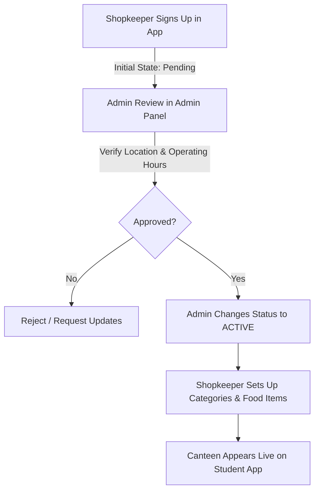

# CampusBite — Multi-College Pilot Operations Handbook

This guide outlines operational procedures, shop onboarding workflows, delivery partner dispatch rules, and emergency protocols for the **6-College CampusBite Pilot**.

---

## 1. Pilot Campus Layout (6 Colleges)

The initial pilot is deployed across **BBD Educational Campus** with six operational colleges and dedicated food hubs:

| College | Building / Block | Primary Canteen |
| :--- | :--- | :--- |
| **BBD University (BBDU)** | Main Academic Block | Central Cafeteria |
| **BBDNITM** | Engineering Block A | Engineering Food Court |
| **BBDNIIT** | Tech Wing B | NIIT Express Bites |
| **BBDCODS** | Clinical Sciences Wing | Dental Campus Cafe |
| **BBDIHM** | Culinary Arts Block | Gourmet Hub |
| **BBDSP** | Pharmaceutical Research Wing | Medico Fast Bites |

Residential Hostels connected to pilot zones:
* **Tagore Boys Hostel**
* **Gargi Girls Hostel**
* **Raman Boys Hostel**
* **Sarojini Girls Hostel**

### 1.1 Initializing Pilot Dataset
To seed the database with the 6 colleges, hostels, canteens, and pilot accounts:
```bash
cd backend
python -m app.scripts.seed_pilot_data
```

---

## 2. Real Shop Onboarding Workflow



### Step 1: Shopkeeper Account Creation
* The shopkeeper downloads the **Shopkeeper Android App** and registers with their Name, Email, Phone, and selects role `SHOPKEEPER`.
* An initial `Shop` profile is created with status `PENDING`.

### Step 2: Admin Review
* The administrator opens `https://admin.campusbite.com/shops`.
* Admin reviews the shop name, contact number, assigned campus, and operating hours.

### Step 3: Admin Approval & Activation
* Admin clicks **Approve** and selects status `ACTIVE` with an audited reason (e.g., *"Canteen verified on site"*).
* The action is immutably recorded in `AuditLog`.

### Step 4: Menu Setup
* The shopkeeper opens the Shopkeeper app and adds Food Categories (e.g. *Snacks, Beverages, Meals*) and Food Items (with price, preparation time, and veg/non-veg flag).

### Step 5: Live Ordering
* The canteen instantly appears under the Student App's canteens catalog for students on that campus.

---

## 3. Delivery Partner Operations & Handover Protocol

### 3.1 Duty Status
* Delivery partners toggle **ONLINE** or **OFFLINE** in the Delivery App.
* Only **ONLINE** riders receive available order alerts.

### 3.2 Order Claiming (Atomic Lock)
* When a canteen marks an order as `READY_FOR_PICKUP`, it appears in `available-orders`.
* Riders tap **Accept Order**. The backend uses an atomic database lock to ensure only one rider can claim the order (transitions to `ASSIGNED`).

### 3.3 Delivery Handover (4-Digit OTP Protocol)
1. Rider arrives at canteen and taps **Mark Picked Up** (`PICKED_UP`).
2. Rider taps **Start Delivery** (`OUT_FOR_DELIVERY`). The backend generates a secure 4-digit OTP valid for 30 minutes.
3. Student sees the OTP code on their active tracking screen.
4. Upon arrival at the student's room/block, student shares OTP verbally with the rider.
5. Rider enters OTP in the app:
   - **Correct OTP**: Transitions order to `DELIVERED`, marks payment as `PAID`, credits rider earnings and shopkeeper payout, and records platform commission.
   - **Incorrect OTP**: Failed attempt recorded.
   - **Brute Force Lock**: After 5 consecutive incorrect attempts, the delivery is locked for that rider to prevent guessing.

---

## 4. Financial Ledger & Settlement

* **Platform Commission**: 10% flat platform commission on order food subtotal.
* **Shopkeeper Share**: 90% of order food subtotal.
* **Delivery Fee**: 100% of delivery fee (₹15.00) credited to the delivery partner.
* **Settlement State**: Stored in `Earning` table with status `UNPAID` until settled by the platform finance team.

---

## 5. Emergency Procedures & Overrides

### 5.1 Emergency Order Override
If an order is stalled (e.g., rider vehicle breakdown or student unavailable):
1. Admin navigates to `/orders/{id}` in Admin Panel.
2. Selects **Emergency Override** and chooses new state (`CANCELLED` or `DELIVERED`).
3. Inputs mandatory explanation in the reason dialog.
4. Status transitions immediately and writes to `AuditLog`.

### 5.2 Vendor / User Suspension
* If a vendor or user violates campus policies, Admin opens `/users` or `/shops` and clicks **Suspend**.
* Prevents subsequent logins and freezes active order placement immediately.
