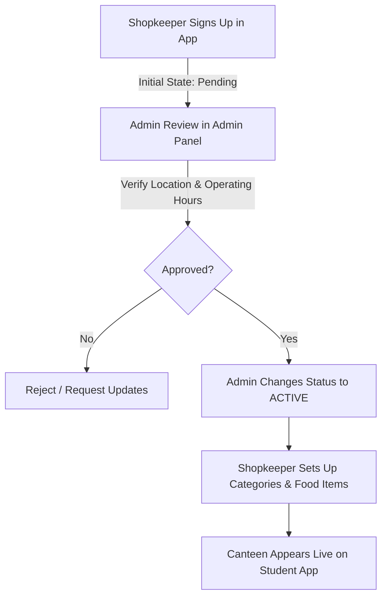

# CampusBite — Pilot Operations & Support Handbook

This guide outlines operational procedures, shop onboarding workflows, delivery dispatch rules, support protocols, and emergency escalation pathways for the **CampusBite College Pilot**.

---

## 1. Pilot Rollout Strategy

CampusBite supports two deployment modes for pilot launch:

### Mode A: Controlled Pilot (Single College Stage Gate - Recommended)
* **Target**: BBD University (BBDU) — Main Academic Block & Science Block.
* **Canteens**: Central Cafeteria & Campus Bakery.
* **Volume**: 10 Test Students, 3 Delivery Partners, 1 Admin.
* **Seed Command**:
  ```bash
  cd backend
  python -m app.scripts.seed_controlled_pilot
  ```

### Mode B: Full Multi-College Pilot (6 Colleges)
* **Target**: All 6 Campus Colleges (BBDU, BBDNITM, BBDNIIT, BBDCODS, BBDIHM, BBDSP) & 4 Residential Hostels.
* **Canteens**: 6 Dedicated Campus Food Hubs.
* **Seed Command**:
  ```bash
  cd backend
  python -m app.scripts.seed_pilot_data
  ```

---

## 2. Real Shop Onboarding Workflow



### Step 1: Shopkeeper Registration
* Shopkeeper registers via the Shopkeeper Android App with Name, Email, Phone, and Canteen Name.
* An initial `Shop` profile is created in `PENDING` state. Unapproved canteens are never exposed to students.

### Step 2: Admin Physical & Operational Review
* Administrator accesses `https://admin.campusbite.com/shops`.
* Admin reviews the shop name, contact number, assigned campus, and operating hours.

### Step 3: Admin Approval & Activation
* Admin clicks **Approve** and sets status to `ACTIVE` with a mandatory audited reason (e.g., *"Canteen verified on site"*).
* Recorded immutably in `AuditLog`.

### Step 4: Menu Setup
* Shopkeeper configures food categories (e.g. *Snacks, Beverages, Meals*) and food items with verified pricing and preparation time.

### Step 5: Live Student Ordering
* The canteen instantly appears under the active canteens catalog for students on that campus.

---

## 3. Delivery Partner Operations & Handover Protocol

### 3.1 Duty Status
* Delivery partners toggle **ONLINE** or **OFFLINE** in the Delivery App.
* Only **ONLINE** riders receive available order pickup alerts.

### 3.2 Order Claiming (Atomic Lock)
* When a canteen marks an order as `READY_FOR_PICKUP`, it appears in `available-orders`.
* Riders tap **Accept Order**. The backend uses an atomic database lock to ensure only one rider can claim the order (transitions to `ASSIGNED`).

### 3.3 Delivery Handover (4-Digit OTP Protocol)
1. Rider arrives at canteen and taps **Mark Picked Up** (`PICKED_UP`).
2. Rider taps **Start Delivery** (`OUT_FOR_DELIVERY`). The backend generates a secure 4-digit OTP valid for 30 minutes.
3. Student sees the OTP code on their active tracking screen.
4. Upon arrival at the student's room/block, student shares OTP verbally with the rider.
5. Rider enters OTP in the app:
   - **Correct OTP**: Transitions order to `DELIVERED`, marks payment as `PAID`, credits rider earnings and shopkeeper payout, and records platform commission.
   - **Incorrect OTP**: Failed attempt recorded.
   - **Brute Force Lock**: After 5 consecutive incorrect attempts, the delivery is locked for that rider to prevent guessing.

---

## 4. Financial Ledger & Settlement

* **Platform Commission**: 10% flat platform commission on order food subtotal.
* **Shopkeeper Share**: 90% of order food subtotal.
* **Delivery Fee**: 100% of delivery fee (₹15.00) credited to the delivery partner.
* **Settlement State**: Stored in `Earning` table with status `UNPAID` until settled by the platform finance team.

---

## 5. Support Operations & Emergency Protocols

### 5.1 Order Cancellation & Refund Rules
* **Before Acceptance**: Orders in `PENDING` status can be cancelled with 100% refund.
* **During Preparation**: Orders in `PREPARING` status require admin intervention before cancellation to protect vendor food costs.
* **Failed Delivery**: If an order cannot be delivered within 45 minutes, Admin cancels the order and marks payment as `REFUNDED`.

### 5.2 Admin Emergency Interventions
* **Stalled Order Override**: Admin navigates to `/orders/{id}` and selects **Emergency Override** with mandatory explanation.
* **Vendor / User Suspension**: If a vendor or user violates campus policies, Admin opens `/users` or `/shops` and clicks **Suspend**, freezing access immediately.

### 5.3 Pilot Operational Contact Placeholders
* **Campus Operations Desk**: `support@campusbite.com` | `+91-98765-00000`
* **Student Help Desk**: Accessible via Student App *Help & Feedback* section.
* **Escalation SLA**: Critical delivery issues resolved within 15 minutes during pilot hours (08:00 AM – 10:00 PM).
