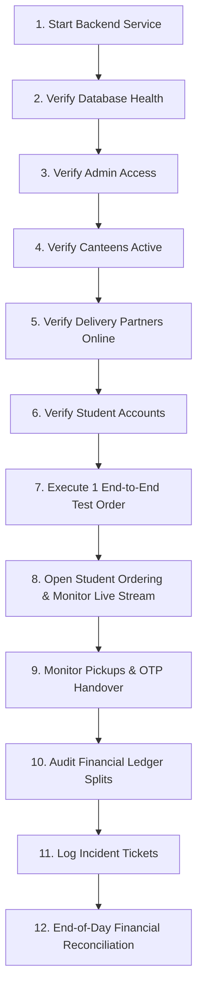

# CampusBite — Pilot Operations & Support Handbook

This handbook outlines the concrete day-of-pilot operational sequence, shop onboarding workflows, delivery dispatch protocols, and administrator incident response procedures for the **CampusBite Controlled Pilot**.

---

## 1. Pilot Rollout Strategy

CampusBite supports two deployment modes for pilot launch:

### Mode A: Controlled Pilot (Single College Stage Gate - Recommended)
* **Target**: BBD University (BBDU) — Main Academic Block & Science Block.
* **Canteens**: Central Cafeteria & Campus Bakery.
* **Volume**: 10 Test Students, 3 Delivery Partners, 1 Admin.
* **Seed Command**:
  ```bash
  cd backend
  python -m app.scripts.seed_controlled_pilot
  ```

### Mode B: Full Multi-College Pilot (6 Colleges)
* **Target**: All 6 Campus Colleges (BBDU, BBDNITM, BBDNIIT, BBDCODS, BBDIHM, BBDSP) & 4 Residential Hostels.
* **Canteens**: 6 Dedicated Campus Food Hubs.
* **Seed Command**:
  ```bash
  cd backend
  python -m app.scripts.seed_pilot_data
  ```

---

## 2. Concrete 12-Step Pilot-Day Operational Sequence

Follow this exact chronological checklist on the morning of pilot launch:



1. **Start Backend Service**: Boot the FastAPI ASGI server (`gunicorn -k uvicorn.workers.UvicornWorker app.main:app` or `systemctl start campusbite-backend`).
2. **Verify Database Connectivity**: Probe `GET /health` and `GET /health/db` to confirm PostgreSQL connectivity.
3. **Verify Admin Web Access**: Administrator logs into `https://admin.campusbite.com` using superadmin credentials.
4. **Verify Active Canteens**: Ensure participating pilot shops have status `ACTIVE` and their menus are marked in-stock.
5. **Verify Delivery Fleet**: Confirm that pilot riders are logged into the Delivery App and toggled **ONLINE**.
6. **Verify Student Accounts**: Confirm test students are assigned to the pilot college and delivery blocks.
7. **Execute 1 End-to-End Test Order**: Place, accept, prepare, claim, and complete a test order with OTP verification to confirm full system readiness before opening to the campus.
8. **Open Live Student Ordering**: Announce pilot availability to test students and monitor incoming orders stream under `/orders`.
9. **Monitor Transit & OTP Verification**: Ensure riders pick up orders and complete deliveries using the 4-digit verbal OTP.
10. **Audit Financial Splits**: Verify 10% platform commission and 90% vendor shares are credited accurately.
11. **Log Operational Incidents**: Document any delays, app crashes, or stockouts in the incident log.
12. **End-of-Day Financial Reconciliation**: Export daily GMV, payout balances, and commission totals in Admin Finance Console.

---

## 3. Real Shop Onboarding Workflow

### Step 1: Shopkeeper Registration
* Shopkeeper registers via the Shopkeeper Android App with Name, Email, Phone, and Canteen Name.
* An initial `Shop` profile is created in `PENDING` state. Unapproved canteens are never exposed to students.

### Step 2: Admin Physical & Operational Review
* Administrator accesses `https://admin.campusbite.com/shops`.
* Admin reviews the shop name, contact number, assigned campus, and operating hours.

### Step 3: Admin Approval & Activation
* Admin clicks **Approve** and sets status to `ACTIVE` with a mandatory audited reason (e.g., *"Canteen verified on site"*).
* Recorded immutably in `AuditLog`.

### Step 4: Menu Setup
* Shopkeeper configures food categories (e.g. *Snacks, Beverages, Meals*) and food items with verified pricing and preparation time.

### Step 5: Live Student Ordering
* The canteen instantly appears under the active canteens catalog for students on that campus.

---

## 4. Delivery Partner Operations & Handover Protocol

### 4.1 Duty Status
* Delivery partners toggle **ONLINE** or **OFFLINE** in the Delivery App. Only **ONLINE** riders receive available order pickup alerts.

### 4.2 Order Claiming (Atomic Lock)
* When a canteen marks an order as `READY_FOR_PICKUP`, it appears in `available-orders`.
* Riders tap **Accept Order**. The backend uses an atomic database lock to ensure only one rider can claim the order (transitions to `ASSIGNED`).

### 4.3 Delivery Handover (4-Digit OTP Protocol)
1. Rider arrives at canteen and taps **Mark Picked Up** (`PICKED_UP`).
2. Rider taps **Start Delivery** (`OUT_FOR_DELIVERY`). The backend generates a secure 4-digit OTP valid for 30 minutes.
3. Student sees the OTP code on their active tracking screen.
4. Upon arrival at the student's room/block, student shares OTP verbally with the rider.
5. Rider enters OTP in the app:
   - **Correct OTP**: Transitions order to `DELIVERED`, marks payment as `PAID`, credits rider earnings and shopkeeper payout, and records platform commission.
   - **Incorrect OTP**: Failed attempt recorded.
   - **Brute Force Lock**: After 5 consecutive incorrect attempts, the delivery is locked for that rider to prevent guessing.

---

## 5. Administrator Incident Response Playbook

| Incident Scenario | Root Cause | Administrator Resolution Procedure |
| :--- | :--- | :--- |
| **Canteen Temporarily Overloaded / Out of Stock** | High order volume or ingredient shortage. | 1. Admin navigates to `/shops` in Admin Portal.<br/>2. Toggles canteen status to `INACTIVE` or instructs shopkeeper to mark items out of stock.<br/>3. Re-enables shop once order queue is cleared. |
| **Delivery Partner Vehicle Breakdown** | Rider flat tyre or mechanical issue in transit. | 1. Admin opens `/orders/{id}`.<br/>2. Executes **Emergency Override** to re-assign order or mark `CANCELLED`.<br/>3. Inputs mandatory explanation in audit prompt. |
| **Student Entered Wrong Room / Unreachable** | Student not answering phone at drop-off location. | 1. Rider attempts phone contact 3 times over 10 minutes.<br/>2. If unreachable, rider contacts Admin Desk.<br/>3. Admin records incident and marks order `CANCELLED` (with food cost protection for vendor). |
| **Student Reports Missing / Wrong Food Item** | Kitchen packaging error. | 1. Student reports issue via app feedback.<br/>2. Admin reviews order details under `/orders/{id}`.<br/>3. Admin issues partial refund or canteen credits replacement item. |
| **Duplicate Order Placed Accidentally** | Student double-tapped checkout. | 1. If duplicate order is still `PENDING`, student cancels second order immediately.<br/>2. If already `ACCEPTED`, Admin overrides status to `CANCELLED` and marks payment `REFUNDED`. |
| **Payment Gateway Timeout / Ambiguity** | Webhook network delay. | 1. Admin checks `/orders/{id}` payment status.<br/>2. If student bank deducted funds but order shows `PENDING`, Admin verifies gateway transaction ID and updates status to `PAID`. |
| **Backend Service / Database Outage** | Process crash or host disconnection. | 1. Monitor alerts via `/health` probe.<br/>2. SSH into host: `sudo systemctl restart campusbite-backend`.<br/>3. Check error logs: `tail -n 100 /var/log/campusbite/error.log`. |

---

## 6. Financial Settlement & Commission Model

* **Platform Commission**: 10% flat platform commission on order food subtotal.
* **Shopkeeper Share**: 90% of order food subtotal credited as `SHOP_SALE`.
* **Delivery Fee**: 100% of delivery fee (₹15.00) credited to the delivery partner as `DELIVERY_PAY`.
* **Settlement State**: Stored in `Earning` table with status `UNPAID` until settled by the platform finance team.

---

## 7. Support & Emergency Contact Escalation

* **Campus Operations Helpdesk**: `support@campusbite.com` | `+91-98765-00000` (Pilot Operations Desk)
* **Escalation Window**: Active during pilot hours (08:00 AM – 10:00 PM).
* **Emergency Response SLA**: Critical delivery issues addressed within 15 minutes.
